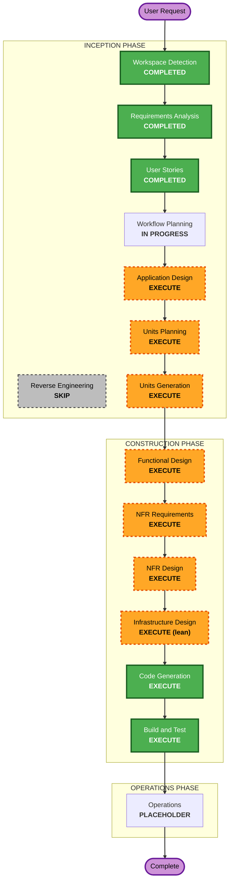

# Execution Plan — ontology-agent (Mini AIP)

## Detailed Analysis Summary

### Change Impact Assessment
- **User-facing changes**: Yes — CS/PM/Sales/Governance がMCP経由で自然言語利用。
- **Structural changes**: Yes — 新規システム（Ontology/RAG/Permission/Action/Audit/MCP の多層）。
- **Data model changes**: Yes — ObjectType/LinkType/ActionType レジストリ + オブジェクト永続化（PostgreSQL）。
- **API changes**: Yes — MCP ツール群（search/get/traverse/aggregate/propose/invoke）。
- **NFR impact**: Yes — セキュリティ（全ルール blocking）、行レベル権限、集計性能、監査改ざん耐性、PBT。

### Risk Assessment
- **Risk Level**: Medium-High（実顧客PII・権限境界の正しさが事故に直結。新規かつ多層）。
- **Rollback Complexity**: Easy（Greenfield・未デプロイ。設計先行）。
- **Testing Complexity**: Complex（権限 invariant・集計・round-trip を PBT で検証）。

## Workflow Visualization

### Mermaid Diagram



### Text Alternative (always included)

```
INCEPTION
- Workspace Detection ....... COMPLETED
- Reverse Engineering ....... SKIP (Greenfield)
- Requirements Analysis ..... COMPLETED
- User Stories .............. COMPLETED
- Workflow Planning ......... IN PROGRESS
- Application Design ........ EXECUTE
- Units Planning ............ EXECUTE
- Units Generation .......... EXECUTE

CONSTRUCTION (per-unit loop)
- Functional Design ......... EXECUTE
- NFR Requirements .......... EXECUTE
- NFR Design ................ EXECUTE
- Infrastructure Design ..... EXECUTE (lean)
- Code Generation ........... EXECUTE
- Build and Test ............ EXECUTE

OPERATIONS
- Operations ................ PLACEHOLDER
```

## Phases to Execute

### 🔵 INCEPTION PHASE
- [x] Workspace Detection (COMPLETED)
- [x] Reverse Engineering (SKIPPED — Greenfield, no existing code)
- [x] Requirements Analysis (COMPLETED)
- [x] User Stories (COMPLETED — 4 personas, 12 stories)
- [x] Workflow Planning (IN PROGRESS)
- [ ] Application Design — **EXECUTE**
  - **Rationale**: 新規の多層システム。コンポーネント責務（Ontology/RAG/Permission/Action/Audit/MCP）と境界・依存の定義が必須。
- [ ] Units Planning — **EXECUTE**
  - **Rationale**: 複数の論理ユニットに分解して段階的に設計・実装するのが妥当。
- [ ] Units Generation — **EXECUTE**
  - **Rationale**: 分解結果を正式なユニット定義として確定。

### 🟢 CONSTRUCTION PHASE（ユニットごと）
- [ ] Functional Design — **EXECUTE**
  - **Rationale**: 新規データモデル・複雑なビジネスロジック（権限解決・クエリ構築）。PBT-01 のプロパティ識別もここで実施。
- [ ] NFR Requirements — **EXECUTE**
  - **Rationale**: セキュリティ（全ルール blocking）、行レベル権限、集計性能、PBT フレームワーク選定（Hypothesis, PBT-09）。
- [ ] NFR Design — **EXECUTE**
  - **Rationale**: NFR Requirements を受けた具体設計（認証・暗号化・fail-closed・監査改ざん耐性）。
- [ ] Infrastructure Design — **EXECUTE（lean）**
  - **Rationale**: 実PIIを扱いセキュリティON のため、暗号化(SECURITY-01)・ネットワーク制限(SECURITY-07)・ログ保持(SECURITY-14) を最小限定義。デプロイ自動化は OPERATIONS へ。
- [ ] Code Generation — **EXECUTE (ALWAYS)**
  - **Rationale**: 実装計画＋コード生成。
- [ ] Build and Test — **EXECUTE (ALWAYS)**
  - **Rationale**: ビルド・テスト（PBT 含む）・検証。

### 🟡 OPERATIONS PHASE
- [ ] Operations — **PLACEHOLDER**（将来のデプロイ・監視）

## Preliminary Unit Decomposition（Units Planning で確定）
- **U1 Ontology Core** — レジストリ、型定義、オブジェクト永続化
- **U2 Permission** — object-type + row-level、解決エンジン（PBT 対象）
- **U3 Retrieval/RAG** — 構造化検索 + 集計（ベクトルは後段）
- **U4 Action** — propose/invoke、承認フロー
- **U5 Audit** — 全イベント構造化記録・検索、改ざん耐性
- **U6 MCP/API** — FastAPI、MCP ツール公開、認証

## ⚠️ Design-First Checkpoint
ユーザーのゴールは「設計ドキュメント先行」。
**自然な停止点は Code Generation の直前**（Application Design + 各ユニットの Functional/NFR/Infra Design 完了時）。
そこで設計一式をレビューし、実装に進むか判断できる。各ステージにも承認ゲートあり。

## Estimated Timeline
- **Total stages to execute (remaining)**: 8（AD, UP, UG, FD, NFRA, NFRD, ID, CG）+ BT
- **Estimated Duration**: 設計フェーズ（AD〜ID）を主体に進行。実装は設計承認後。

## Success Criteria
- **Primary Goal**: Mini AIP（Ontology + RAG + Permission + Action + Audit）の設計一式を、AI-DLC のゲートを通して確定する。
- **Key Deliverables**: application-design、units、functional/NFR/infra design、(承認後) code & tests。
- **Quality Gates**: 各ステージの承認、Security 全ルール非ブロッキング、PBT(Partial) 準拠。
